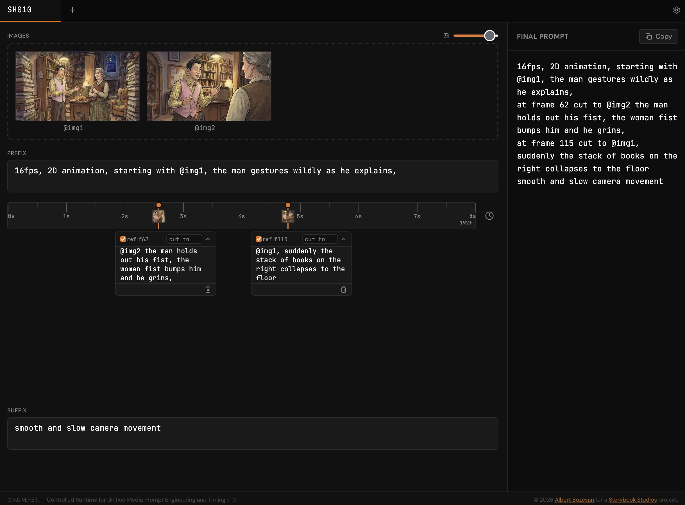

<p align="center">
  
</p>

<h1 align="center">CRUMPET</h1>

<p align="center">
  <strong>C</strong>ontrolled <strong>R</strong>untime for <strong>U</strong>nified <strong>M</strong>edia <strong>P</strong>rompt <strong>E</strong>ngineering and <strong>T</strong>iming
</p>

<p align="center">
  A timeline-based prompt builder for cutting-edge AI video models like Seedance 2.0.
</p>

---

<p align="center">
  
</p>
<p align="center"><em>Drop images, place markers, write prompts. CRUMPET handles the structure and timing.</em></p>

---

## What is CRUMPET?

CRUMPET helps you compose precise, frame-accurate text prompts for AI video generation tools. Drop in your keyframes and reference images, place timed markers on a timeline, write prompt fragments for each marker, and CRUMPET assembles everything into a clean final prompt — ready to use.

## Getting Started

```bash
# Clone the repo
git clone https://github.com/albozes/crumpet.git
cd crumpet

# Install dependencies
npm install

# Start the dev server
npm run dev
```

Open [http://localhost:5173](http://localhost:5173) in your browser and you're good to go.

## How to Use

### 1. Drop Your Images

Drag and drop images into the area at the top, or click it to browse your files. Each image gets an automating `@img` label you can rename by clicking the pencil icon.

### 2. Set Up Your Timeline

Click the clock icon to adjust duration (in seconds) and frame rate (24, 25, 30, or 60 fps). The timeline ruler updates to match.

### 3. Place Markers

Click anywhere on the timeline to place a marker. A popup lets you assign one of your images to it.

### 4. Write Prompts

Each marker has a text box where you write your prompt fragment. Describe what should happen at that point in the video, and select from a preset transition or write your own. You can also add a prefix and suffix that wrap the entire prompt.

### 5. Copy Your Prompt

The right sidebar shows the assembled prompt in real time. Hit the copy button and paste it into your video generation tool of choice.

### Tabs

CRUMPET supports multiple multi-shot prompt at once. Each tab is an independent workspace with its own images, timeline, and markers, but custom settings are shared. Click on the tab label to rename it!

### Persistence

Your work is automatically saved to your browser's local storage. Close the tab, come back later, and everything is right where you left it. Closing tabs deletes their contents.

## Get a new buddy!

CRUMPET is best pals with [Shotbuddy](https://github.com/albozes/shotbuddy), another free and open-source app for managing shots in AI-driven image-to-video workflows. Check it out!

## Credits

CRUMPET was created by [Albert Bozesan](https://albertbozesan.com/)

## License

CRUMPET is released under the [MIT License](LICENSE).

### Third-Party Packages

CRUMPET is built with the following open-source libraries:

| Package | License |
|---|---|
| [React](https://react.dev/) | MIT |
| [Vite](https://vite.dev/) | MIT |
| [Lucide React](https://lucide.dev/) | ISC |
| [Tailwind CSS](https://tailwindcss.com/) (Play CDN) | MIT |
